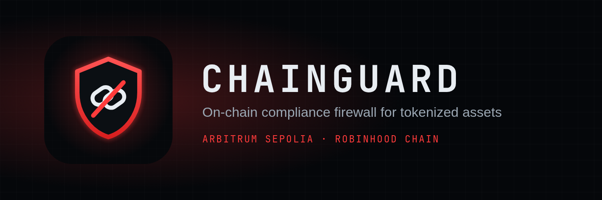
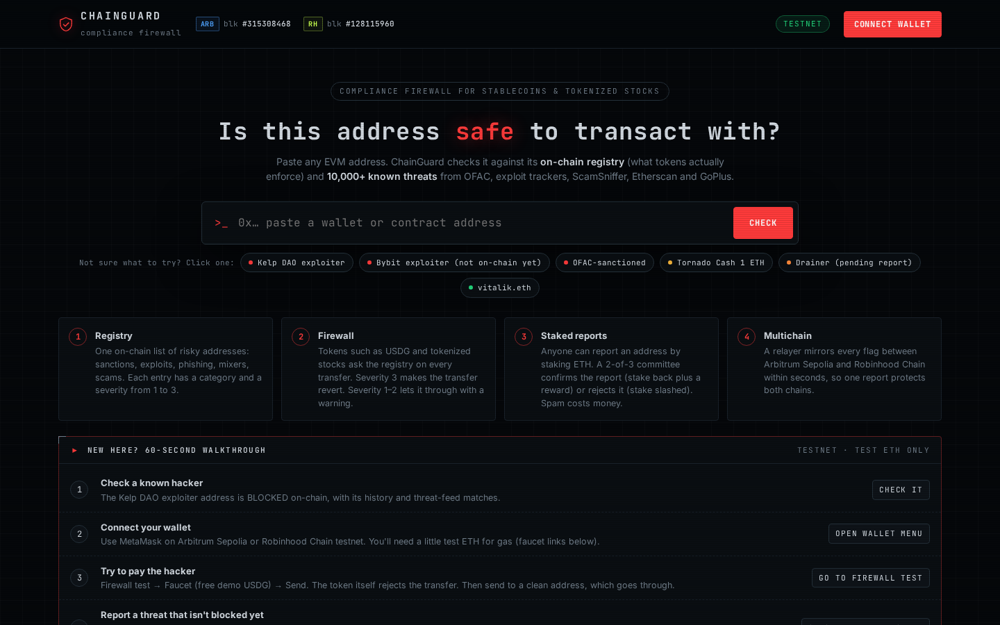
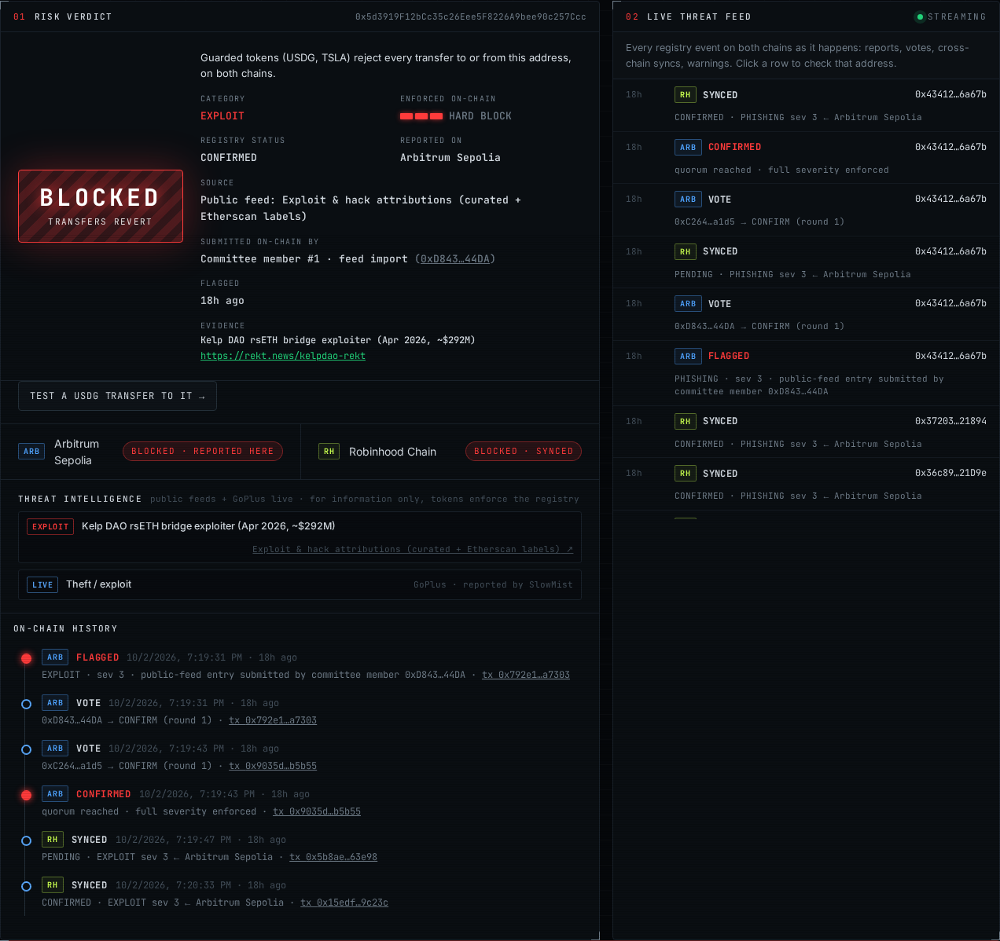
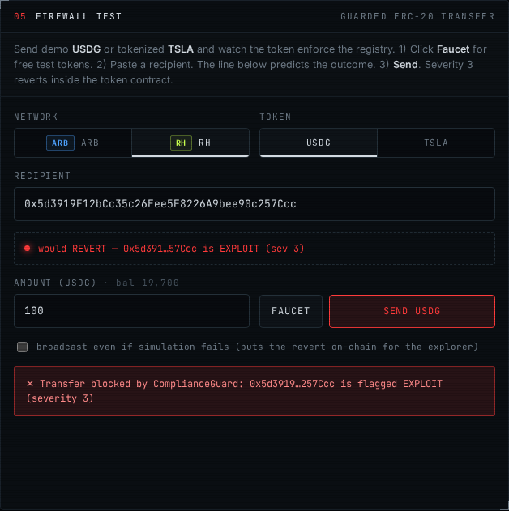
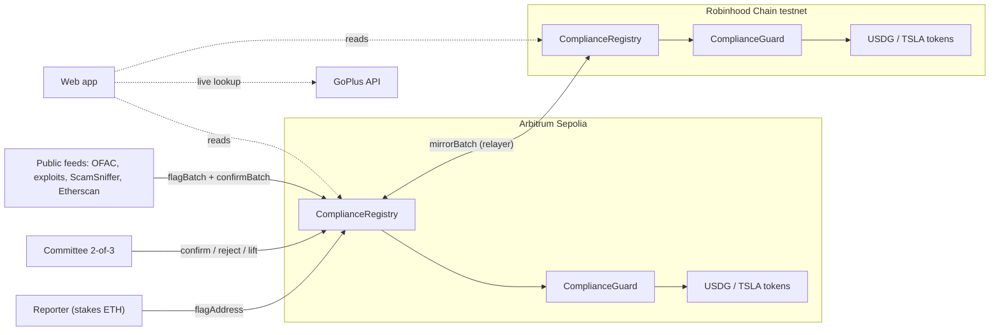
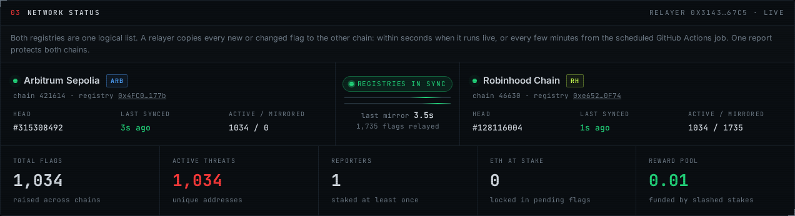

# ChainGuard



**An on-chain compliance firewall for stablecoins and tokenized stocks.**
The token itself refuses to move funds to hackers, wallet drainers and sanctioned addresses. It runs live on **Arbitrum Sepolia** and **Robinhood Chain testnet**, sharing one threat registry kept in sync across both chains.

**Live demo:** https://chain-guard-frontend.vercel.app · **Video:** _<add link>_ · **Contracts:** [verified on Blockscout](#deployed-contracts)



---

## The problem

A broker is legally required to screen who it trades with. An ERC-20 screens no one. As stock tokens on Robinhood Chain and stablecoins like USDG start bridging regulated finance and DeFi, an address behind a $292M bridge exploit, a phishing kit or an OFAC listing can still receive and trade them. Today's only answer is off-chain: an exchange freezes a deposit after the fact. Nothing stops the transfer itself.

## What ChainGuard does

| | |
|---|---|
| 🛡 **Blocks at the token level** | Every transfer, mint and burn asks a shared registry about both parties. Severity 3 makes it revert with `AddressBlocked(account, category, severity)`. Severity 1–2 lets it through and emits an on-chain `ComplianceWarning`, the "yellow flag" banks use. |
| 🗂 **Real threat data** | 10,232 labelled addresses from public sources: OFAC, exploit attributions (Kelp DAO, Bybit, Ronin, Multichain, Nomad…), ScamSniffer, Etherscan, MyEtherWallet, and on-chain-verified Tornado Cash pools. Every check also queries GoPlus live (SlowMist, BlockSec). |
| ⚖️ **Spam-resistant reporting** | Anyone can report an address by staking ETH. A 2-of-3 committee confirms it (stake back + 20%) or rejects it (stake slashed, half goes to the wrongly accused). Until quorum, a report is only a soft warning, so nobody can freeze funds by griefing. |
| 🔗 **One registry, two chains** | A relayer mirrors every flag between Arbitrum Sepolia and Robinhood Chain. Measured on testnet: **3.95 s** from committee quorum on Arbitrum to the address being blocked on Robinhood Chain. |

<table><tr>
<td></td>
<td></td>
</tr><tr>
<td align="center">Kelp DAO exploiter: blocked on both chains, with sources and on-chain history</td>
<td align="center">Sending USDG to it reverts inside the token contract</td>
</tr></table>

## Try it in 2 minutes

On the [live site](https://chain-guard-frontend.vercel.app) (no wallet needed for steps 1–2):

1. Click **Kelp DAO exploiter** → **BLOCKED**, category EXPLOIT, with threat-feed matches and its on-chain history on both chains.
2. Click **Tornado Cash 1 ETH** → **WARNING** (mixer, allowed but monitored). Click **vitalik.eth** → **CLEAN**.
3. Connect MetaMask on Robinhood Chain testnet. In **Firewall test**: *Faucet* (free demo USDG), then send to the Kelp exploiter → reverts. Send to vitalik.eth → goes through.
4. Click **Bybit exploiter** → **KNOWN THREAT**: public feeds know it, but the registry doesn't enforce it yet. Click *Report to registry*, stake and submit. It becomes a soft warning until the committee confirms it.

Networks for MetaMask:

| Network | Chain ID | RPC | Faucet |
|---|---|---|---|
| Arbitrum Sepolia | 421614 | `https://sepolia-rollup.arbitrum.io/rpc` | [Alchemy](https://www.alchemy.com/faucets/arbitrum-sepolia) |
| Robinhood Chain testnet | 46630 | `https://rpc.testnet.chain.robinhood.com/rpc` | [Robinhood](https://faucet.testnet.chain.robinhood.com) |

## Architecture



### Contracts

| Contract | Responsibility |
|---|---|
| [`ComplianceRegistry`](contracts/src/ComplianceRegistry.sol) | The list of risky addresses. Each `Flag` has a category (SANCTIONED, EXPLOIT, PHISHING, MIXER, RUGPULL, SCAM_REPORTED), a severity 1–3, an evidence hash and URI, the reporter, a status and the source chain. It handles staking, committee votes, appeals, expiry, payouts (pull-based `withdraw`), batch import (`flagBatch` / `confirmBatch`) and cross-chain mirroring (`mirrorBatch`). `riskOf(address)` is the one call integrations need. |
| [`ComplianceGuard`](contracts/src/ComplianceGuard.sol) | The enforcement hook shared by any number of tokens. `check(from, to, amount)` reverts or warns. `preview(from, to)` lets UIs predict the outcome before sending. |
| [`ComplianceGuardedERC20`](contracts/src/tokens/ComplianceGuardedERC20.sol) | An abstract ERC-20 that calls the guard from `_update` (OpenZeppelin v5), so transfers, mints and burns are all screened. Any token can inherit it. |
| [`MockUSDG`](contracts/src/tokens/MockUSDG.sol), [`MockStockToken`](contracts/src/tokens/MockStockToken.sol) | Demo stablecoin (6 decimals) and tokenized TSLA, with faucets. The real USDG isn't available on these testnets. |

### Why the reporting can't be abused

1. **Stake to report.** Reporters outside the committee lock at least `minStake`.
2. **Pending = soft only.** `riskOf` caps an unconfirmed flag at severity 1, so a griefer can buy a yellow flag but can never freeze funds.
3. **Quorum decides.** 2 of 3 committee members must confirm or reject. A member's own report counts as their vote.
4. **Incentives.** Confirmed: stake back + 20% from the reward pool. Rejected: the stake is slashed, 50% to the wrongly accused address and 50% to the pool. Farming compensation with a self-report loses half the stake.
5. **Due process.** The flagged address can `fileAppeal`, and the committee can `unflagAddress`. If the committee never acts, anyone can `expireFlag` after 3 days and the reporter is refunded.

### Cross-chain consistency

- Each flag records its `sourceChainId`. Only that chain can vote on or resolve it, and mirrored copies reject local votes (`ForeignFlag`).
- Mirrors are full snapshots that only move forward: a newer round, or the same round with a later status. Replays and out-of-order deliveries are skipped (`StaleMirror`).
- A mirror never overwrites a live flag governed by another chain (`MirrorConflict`), so stakes stay safe.
- The relayer queues the latest snapshot per address and writes in batches of 100. After a restart it rescans both registries and catches up.
- **Always on, no server.** A [GitHub Actions job](.github/workflows/relayer.yml) runs the relayer in one-shot mode every ~5 minutes. Running it live (`scripts/testnet-relayer.sh start`) gives the ~4 s sync. Both modes can run together.

### Threat intelligence

[`build-intel.ts`](relayer/src/build-intel.ts) compiles public feeds into one labelled database ([`threat-db.json`](shared/intel/threat-db.json)). [`import-intel.ts`](relayer/src/import-intel.ts) writes it on-chain through committee batch votes (~176k gas per address).

| Source | Addresses | Category · severity |
|---|---:|---|
| US Treasury OFAC SDN list | 120 | SANCTIONED · 3 |
| Exploit attributions: curated + Etherscan labels (Ronin, Multichain, Nomad, BadgerDAO, KyberSwap…) | 300 | EXPLOIT · 3 |
| Malicious contracts & deployers (Forta labelled datasets) | 611 | PHISHING / EXPLOIT · 3 |
| Etherscan phish/hack labels (Forta labelled datasets) | 7,077 | PHISHING · 3, SCAM · 2 |
| ScamSniffer drainer blacklist | 2,530 | PHISHING · 3 |
| MyEtherWallet darklist | 652 | PHISHING / SCAM |
| Tornado Cash pools, verified on-chain via `denomination()` | 9 | MIXER · 2 (warn, don't block) |

On testnet, the 1,033 highest-value entries (OFAC, exploits, mixers, malicious contracts) are enforced on-chain on both chains. The app screens every address against the full database plus GoPlus. A known threat that isn't enforced yet shows as **KNOWN THREAT**, with a one-click report. The UI keeps two things separate: the threat **source** (e.g. "Public feed: OFAC") and the account that **submitted it on-chain** (e.g. "Committee member #1 · feed import").

## Deployed contracts

All source code is verified on Blockscout.

| Contract | Arbitrum Sepolia (421614) | Robinhood Chain testnet (46630) |
|---|---|---|
| ComplianceRegistry | [`0x4FC00B31…9177b`](https://arbitrum-sepolia.blockscout.com/address/0x4FC00B3132F5121978A82D0a0f79f9B79869177b?tab=contract) | [`0xe65245bC…50F74`](https://explorer.testnet.chain.robinhood.com/address/0xe65245bC1181e34FD75a13457AD1A0Bb87050F74?tab=contract) |
| ComplianceGuard | [`0x02aA4623…35F61`](https://arbitrum-sepolia.blockscout.com/address/0x02aA4623077e01303Ebd3aA51F6080b944C35F61?tab=contract) | [`0x4aAE0065…Bba73`](https://explorer.testnet.chain.robinhood.com/address/0x4aAE00651Db7bD38609b8f484E991090981Bba73?tab=contract) |
| USDG (demo) | [`0xc986f96a…d0eCb`](https://arbitrum-sepolia.blockscout.com/address/0xc986f96a29EDd0A99599A76bf51f771c98dd0eCb?tab=contract) | [`0x6B65976C…4B4BB`](https://explorer.testnet.chain.robinhood.com/address/0x6B65976C2faED7F1c5368408F7EF56432EE4B4BB?tab=contract) |
| TSLA Stock Token (demo) | [`0x6F7948cf…5d035`](https://arbitrum-sepolia.blockscout.com/address/0x6F7948cf238fDAD86CE9364AF06E0a203df5d035?tab=contract) | [`0x97125C80…A90Dc`](https://explorer.testnet.chain.robinhood.com/address/0x97125C80fE5Ed717a341250b87714acda5dA90Dc?tab=contract) |

Committee (2-of-3): `0xD843CBe0…944DA`, `0xC264A0D0…ba1d5`, `0x7e125358…56AF3`. Relayer: `0x31436123…667C5`.



## Run it yourself

Requires [Foundry](https://getfoundry.sh), [Bun](https://bun.sh) and `jq`.

```bash
# tests
cd contracts && forge test                    # 26 tests, incl. fuzzing of stake accounting

# full local stack: two anvil chains with the real chain IDs, deploy, relayer, ~1k threats imported
(cd relayer && bun install) && (cd frontend && bun install)
scripts/local-up.sh                           # FULL_IMPORT=1 imports all 10k (needs ~1.5 GB RAM per chain)
cd frontend && bun run dev                    # http://localhost:5173, with built-in demo wallets (no MetaMask)
scripts/local-down.sh

# app against the live testnet deployment
cd frontend && bun run dev:testnet
```

<details>
<summary>Deploy your own copy to the testnets</summary>

```bash
cp .env.example .env                          # deployer key, 3 committee addresses, relayer address
scripts/deploy-testnet.sh                     # both chains, writes contracts/deployments/testnet/*.json
scripts/verify.sh                             # Blockscout (Sourcify fallback)
scripts/testnet-relayer.sh start              # live relayer, status on :8788
cd relayer && MODE=testnet CHAIN=arbitrum COMMITTEE_KEYS=0xk1,0xk2 \
  SOURCES=ofac,exploits,mixers,contracts bun src/import-intel.ts
cd relayer && bun src/build-intel.ts          # refresh the threat feeds
```
The site deploys to Vercel from the repo root (`vercel.json`). For the scheduled relayer, add the repository secret `RELAYER_PRIVATE_KEY`.
</details>

### Repository layout

```
contracts/   Solidity (Foundry): registry, guard, guarded ERC-20, demo tokens, tests, deploy script
relayer/     Bun + viem: cross-chain relayer (live / --once), threat-feed builder, on-chain importer
frontend/    Vite + React + wagmi/viem web app (reads both chains directly, no backend)
shared/      chain metadata, generated ABIs, threat-intel logic and compiled database
scripts/     local stack, deploy, verify, relayer helpers
docs/        screenshots
```

## Trust assumptions & roadmap

- **Relayer.** It is a single trusted key today. Next step: carry flags over Arbitrum native messaging, Hyperlane or CCIP, so a mirror comes with a proof instead of a signature.
- **Committee.** Fixed at deploy time. Next step: rotation and threshold changes through governance, and per-category committees (e.g. sanctions vs. scams).
- **Tokens.** USDG and TSLA here are demo tokens with the standard ERC-20 interface. Real issuers would plug `ComplianceGuard` into their own transfer-restriction hooks.
- **Evidence.** It is a hash plus a URI emitted in events. Pinning evidence to IPFS/Arweave is future work.
